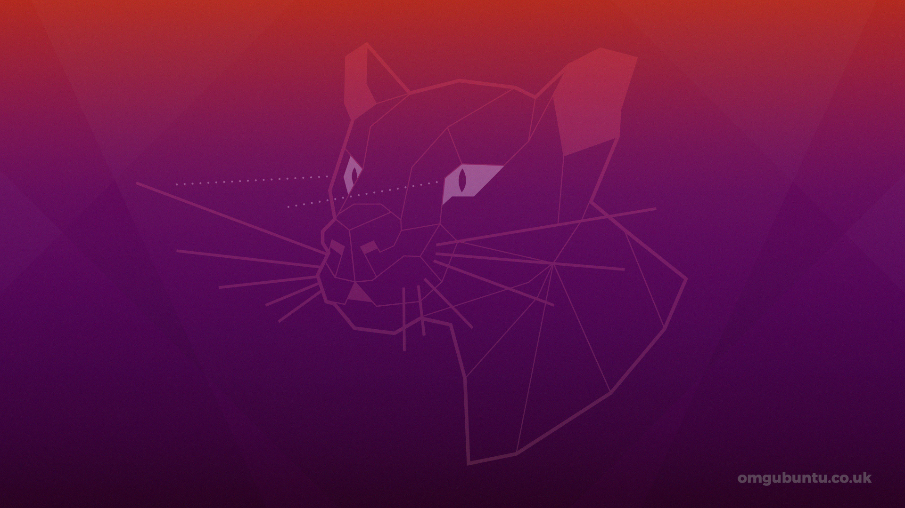
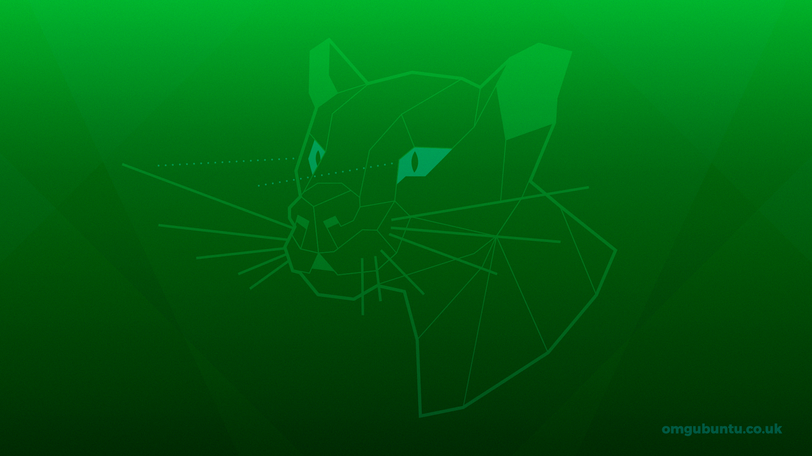
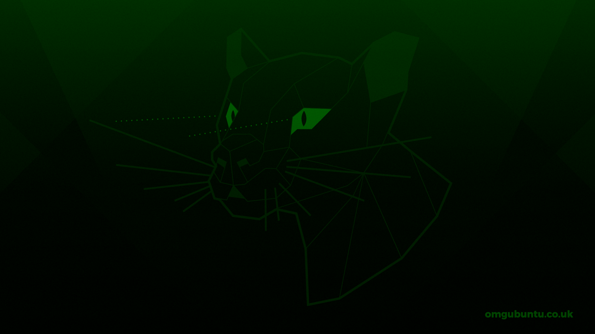

# A Quick Utility to Rotate the Colors on an Image

run from the command line using "python wallpaper.py"

Creates 512 images in the 'focal_fossa' directory with all combinations of color channels rotated and inverted.

## Original Artwork:

I'm sorry I don't know who to credit for the original design.

## Examples of Color-Shifted Wallpaper:

https://www.omgubuntu.co.uk/2020/02/ubuntu-20-04-wallpaper-revealed

https://github.com/ljbelenky/wallpaper_color_shifter

https://twitter.com/omgubuntu/status/1233156264122867716?s=20
